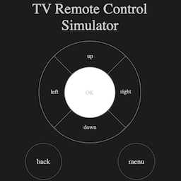

## Read this in other languages： [Chinese](./README.md) | English


## Description


`tv-remote-control` is a tv remote control simulator running on the browser. With it, you can easily remotely control the Android TV or other Android devices connected to your computer just simply by clicking buttons, no more complicated adb command since today!





## Installation


Run the `tv-remote-control` command from the Command Palette (`Shift + command + p (macOS)` or `shift + ctrl+ P (windows)`) in the new window.


## Details


Ensure the USB debugging of device (Android system) is allowed, and then connect your device to your computer. Once connected, you may use the command below to check if the device connects successfully.


```shell
$ adb devices
List of devices attached
emulator-5554 offline   # Google emulator
14ed2fcc device         # Physical device
```


The device was connected successfully if you see `device` on the right side of the list (please ensure only one devices connected to your computer). And then you can click the button on the page or press specified keyboard key to simulate the remote control operating the tv device that connects to your computer.


 A detailed description of the buttons and keyboard keys you can use is listed in the table below.


| Button  | Key of Keyboard| Command of Tv Remote Control |
| ------- | -------------- | ---------  |
| up      | up             | up         |
| left    | left           |left        |
| right   | right          |right       |
| down    | down           | down       |
| ok      | enter          | ok         |
| menu    | shift          | menu       |
| back    | B              | back       |